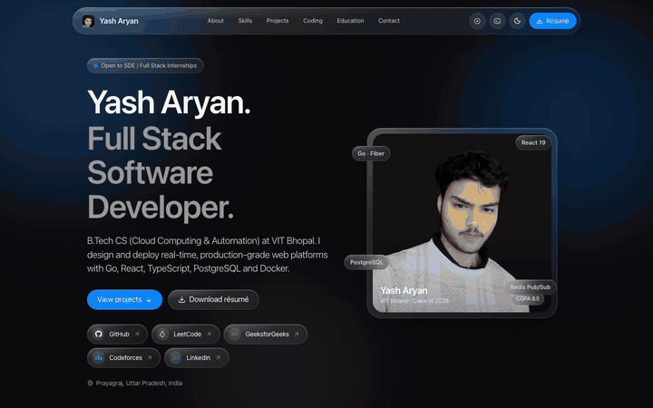
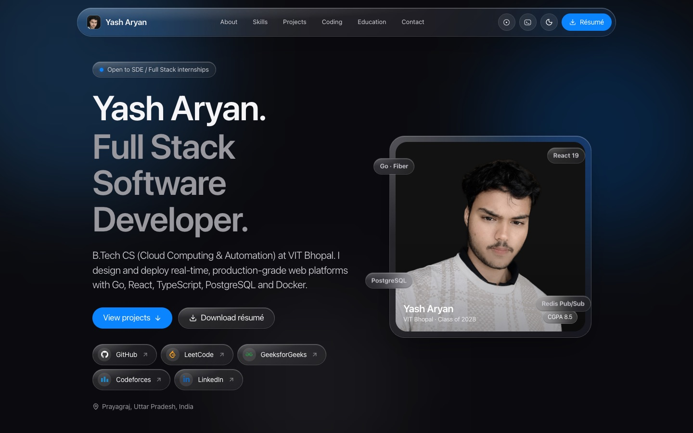
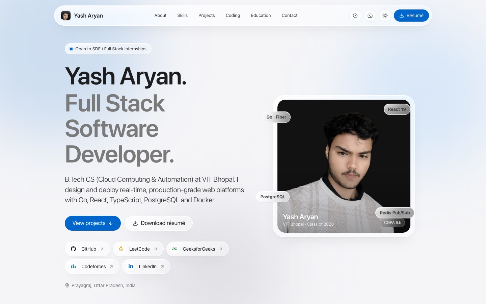
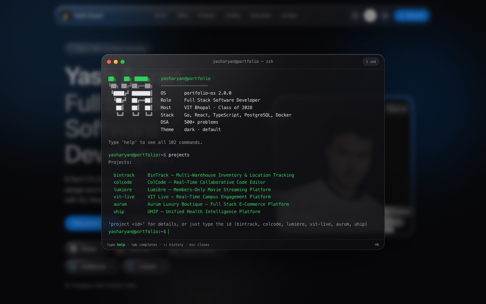

<div align="center">


<a href="https://my-portfolio-web-murex.vercel.app">
  
</a>

<br />

<a href="https://my-portfolio-web-murex.vercel.app"></a>
<a href="https://my-portfolio-web-murex.vercel.app/now"></a>
<a href="https://my-portfolio-web-murex.vercel.app/Yash_Aryan_Resume.pdf"></a>

<br />


</div>

<br />

<p align="center">
  <a href="https://my-portfolio-web-murex.vercel.app">
    
  </a>
</p>

<p align="center"><sub>A scroll through the live site — hero, about, skills, projects, coding profiles, education and contact.</sub></p>

---

## About

I'm Yash, a B.Tech Computer Science student (Cloud Computing & Automation) at **VIT Bhopal**, Class of 2028, based in Prayagraj, India. I build real-time, production-grade web platforms with **Go, React, TypeScript, PostgreSQL and Docker**, and I'm open to **SDE / Full Stack internships**.

This repository is my personal portfolio: an Apple-inspired, liquid-glass single-page site that renders every section from one set of typed data files, ships a fully working terminal, and reads my GitHub activity live.

<div align="center">

| 500+ | 8.5 / 10 | 6 | 102 |
| :---: | :---: | :---: | :---: |
| DSA problems solved | CGPA at VIT Bhopal | Projects showcased | Terminal commands |

</div>

## Highlights

- **Liquid-glass design system.** Frosted panels with a cursor-following specular highlight, magnetic pill buttons, a shine sweep on hover and a floating frosted navigation bar. Every color, radius and type size comes from Apple design tokens in `DESIGN.md`.
- **Light and dark themes.** The toggle persists to local storage and otherwise follows the OS setting, applied before first paint so there is no flash.
- **Built-in terminal.** Press <kbd>⌘</kbd> <kbd>K</kbd> anywhere to open a zsh-style terminal with tab completion, history, colour palettes and over a hundred commands, all sourced from the same data that renders the page.
- **Live GitHub heatmap.** A Vercel function reads github.com directly, so the contribution graph is timezone-correct to the day, refreshes every five minutes and offers year tabs that extend automatically.
- **A `/now` page.** What I'm learning, where I am, the local time and the projects actively getting commits, in the same card template as the rest of the site.
- **Motion with restraint.** Framer Motion drives section reveals, staggered chips and 3D-tilting portrait, and everything respects reduced-motion preferences.

## Projects on the site

| Project | What it is | Stack |
| :-- | :-- | :-- |
| [BinTrack](https://github.com/yasharyan90/BinTrack) · [live](https://bin-track-ih61.vercel.app/) | Multi-warehouse inventory and location tracking with scan-verified picking, FEFO allocation and rules enforced in Postgres | React, TypeScript, Supabase, PL/pgSQL, pgTAP |
| [ColCode](https://github.com/yasharyan90/ColCode) | Real-time collaborative code editor with CRDT sync and sandboxed code execution | React, Yjs, WebSockets, Fastify, Docker |
| [Lumière](https://lumiere-project-lime.vercel.app/) | Members-only movie streaming platform in up to 1080p | Next.js, Neon Postgres, Cloudflare CDN |
| [VIT Live](https://github.com/yasharyan90/vit-live) | Real-time campus engagement platform with 5-role RBAC and payments | Go (Fiber), React 19, Redis Pub/Sub |
| [Aurum](https://aurum-luxury-ecom-store-main-store-six.vercel.app) | Production luxury e-commerce store processing real transactions | React, Supabase, Razorpay |
| UHIP | Cloud-native multi-service healthcare platform, awarded S Grade | Docker Compose, FastAPI, MongoDB |

## Screens

<table>
  <tr>
    <td align="center" width="50%">
      <br />
      <sub>Hero · dark</sub>
    </td>
    <td align="center" width="50%">
      <br />
      <sub>Hero · light</sub>
    </td>
  </tr>
  <tr>
    <td align="center" colspan="2">
      <br />
      <sub>The ⌘K terminal running <code>projects</code></sub>
    </td>
  </tr>
</table>

## Under the hood

```
src/
  data/          all content: profile, socials, skills, projects, education, certifications, now
  components/    ui (glass panels, buttons, theme toggle) · layout (nav, background, footer) · sections · terminal
  terminal/      command registry and renderer for the ⌘K terminal
  hooks/         theme, active section, routing
  lib/           shared Framer Motion variants
api/             Vercel function that serves the live GitHub contribution calendar
public/          portrait, project covers, résumé
DESIGN.md        Apple design tokens (source of truth for colour, type and radius)
```

Content is edited only in `src/data`. Adding a social profile or a project there updates the hero, the section cards, the terminal and the `/now` page together. Deploys happen automatically from `main` through Vercel, with a single-page rewrite, immutable asset caching and security headers configured in `vercel.json`.

## Connect

<div align="center">

<a href="https://github.com/yasharyan90"></a>
<a href="https://www.linkedin.com/in/yasharyan90/"></a>
<a href="https://leetcode.com/u/Yash_Aryan90/"></a>
<a href="https://codeforces.com/profile/yasharyan90"></a>
<a href="https://www.geeksforgeeks.org/profile/yasharyanno80"></a>
<a href="mailto:yasharyanchunar90@gmail.com"></a>

<br /><br />


</div>
